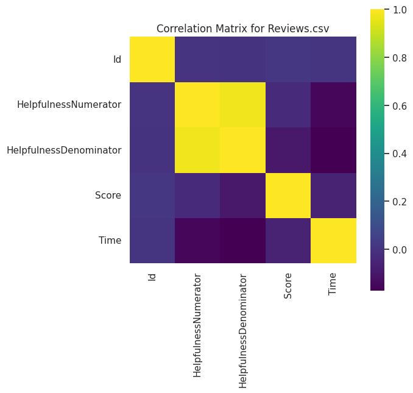
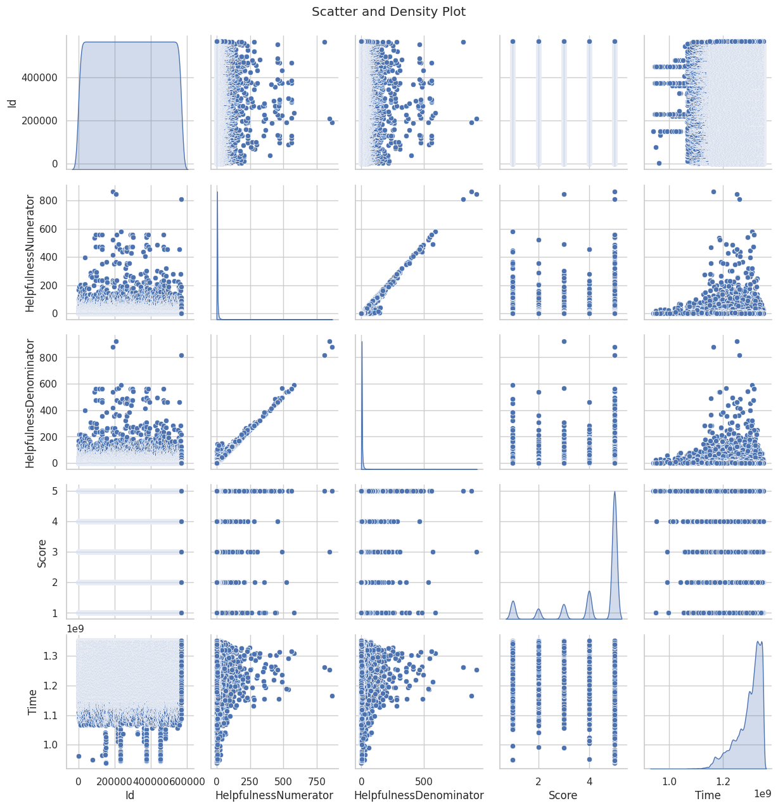
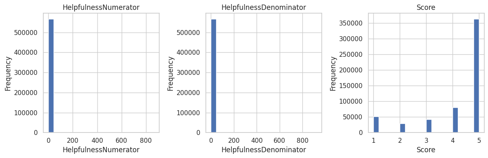

# Amazon Fine Food Reviews Sentiment

Uses [Amazon Fine Food Reviews](https://www.kaggle.com/datasets/snap/amazon-fine-food-reviews/data) to classify each review as **positive** or **negative**. Trains a **LogisticRegression** on TF-IDF features (max 10k, bigrams) with ~300 iterations.

## How It Works
1. **Load** `Reviews.csv`  
2. **EDA**: Plots correlation, pairplots, histograms  
3. **Preprocessing**: Creates `Sentiment` (1 if `Score`>3), cleans text  
4. **TF-IDF**: Vectorizes with up to 10,000 features (`(1,2)`-grams, English stop words)  
5. **Model**: Trains **LogisticRegression** (`solver="saga"`, `max_iter=300`)  
6. **Result**: Achieves ~90% accuracy, writes `submission.csv` with `RowID` and `PredictedSentiment`.

This project demonstrates **basic text classification** on a large dataset, combining **EDA**, **text cleaning**, **TF-IDF**, and a **logistic model** for sentiment. 
